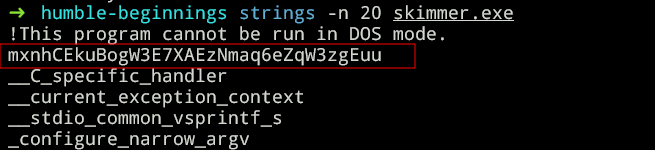

# JerseyCTF IV rev/bin challenges
I played JerseyCTF with the team [S.h.i.c.h.i.b.u.k.a.i](https://ctftime.org/team/274059) and here is the solutions for the challenges from rev/bin category.

**Challenges:**
1. [humble-beginnings](##humble-beginnings)
2. [PasswordManager](#PasswordManager)
3. [Section Two](#section-two)
4. [Conclusion](#conclusion)

## humble-beginnings

we are given an exe, just run strings on it to see flag.

flag: `jctf{mxnhCEkuBogW3E7XAEzNmaq6eZqW3zgEuu}`