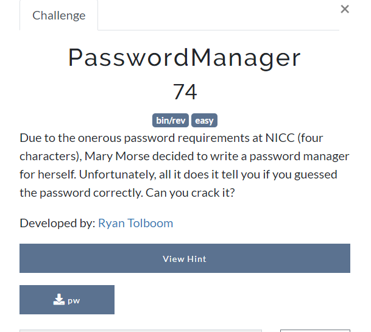
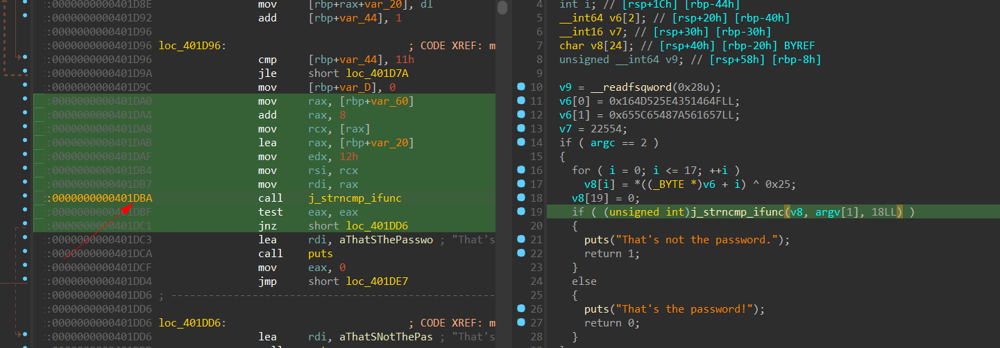
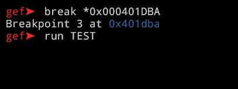
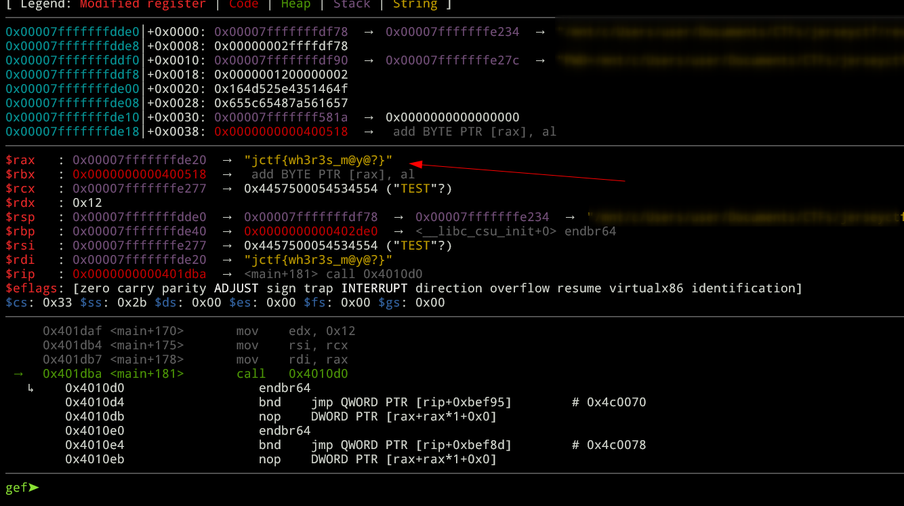

# JerseyCTF IV rev/bin challenges
I played JerseyCTF with the team [S.h.i.c.h.i.b.u.k.a.i](https://ctftime.org/team/274059) and here is the solutions for the challenges from rev/bin category.

**Challenges:**
1. [humble-beginnings](##humble-beginnings)
2. [PasswordManager](#PasswordManager)
3. [searching-through-vine](#searching-through-vine)
4. [MathTest](#MathTest)
5. [the-heist-1](#the-heist-1)
6. [RunningOnPrayers](#RunningOnPrayers)
7. [StageLeft](#StageLeft)
8. [Postage](#Postage)

## humble-beginnings

we are given an exe, just run strings on it to see flag.

flag: `jctf{mxnhCEkuBogW3E7XAEzNmaq6eZqW3zgEuu}`

## PasswordManager)

We are given an ELF file, to decompile it we can use IDA.

It doing XOR on the input and compare this with a string value, we can set a breakpoint on `0x000401DBA` using `gdb` to see it.

Flag: `jctf{wh3r3s_m@y@?}`

## searching-through-vine)

## MathTest)

## the-heist-1)

## RunningOnPrayers)

## StageLeft)

## Postage)
